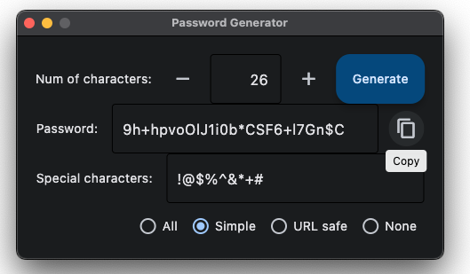

# Password Generator in Python
## CLI version
### passgen.py
Execute it as a Python script and it generates password using `secrets` module. By default it generates a 12-character long alphanueric password with special characters (`secrets.punctuation`). You can give it options (1) a number to change the number of characters (2) a list of special characters in quotes or a minus character (-) to remove spechial character.

Default specil characters (`string.punctuation`): !"#$%&'()*+,-./:;<=>?@[\]^_`{|}~

Examples:  
`python3 passgen.py` # outputs a 12-character password with special characters.  
`python3 passgen.py 16` # outputs a 16-character password with special characters.  
`python3 passgen.py 20 "%#$_-"` # outputs a 20-character password with given characters i.g. %#$_-.  
`python3 passgen.py 20 -` # outputs a 20-character password with no special character.  

## Desktop app (GUI) version
### fletpassgen.py
  
This is a Flet desktop app version of password generator. You need to install flet module by executing `pip install flet`. The app version has a little more flexibility and generates securer password. Click on the copy button and you can easily use the generated password by pasting it. 
To launch the app, execute as below:  

`python3 fletpassgen.py`  
or  
`flet run fletpassgen.py`

